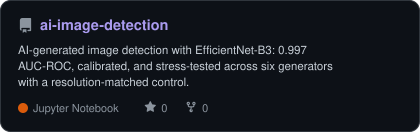
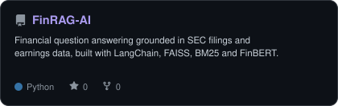
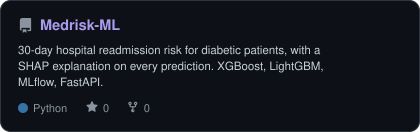
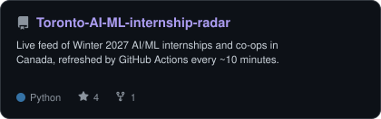
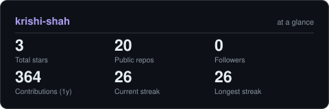

<!-- BANNER - terminal profile.sh --live (additive). Generated by scripts/banner/generate.py.
     ~0.9 MB each. Cache-bust with ?v=N after regenerating. -->
<picture>
  <source media="(prefers-color-scheme: dark)"  srcset="assets/banner-dark.v10.svg">
  <source media="(prefers-color-scheme: light)" srcset="assets/banner-light.v10.svg">
  
</picture>

 

<!-- NAME / TAGLINE - animated typing -->

 

<!-- SOCIALS — LinkedIn stays brand blue (glyph vanishes on custom fills). Others themed. -->
&nbsp;&nbsp;
&nbsp;&nbsp;

---

## About me

Hi, I'm **Krishi**, a final-year Honours Computer Science student at **York University** in Toronto 🇨🇦.
I build applied machine learning and generative AI systems end to end: data validation, training,
calibration, explainability, and deployment.

- 🔬 **AI Research Assistant at York** (supervised by Prof. Mona Nasery): fine-tuned EfficientNet-B3 on 120K images to **0.997 AUC-ROC**, calibrated it to an ECE of **0.0026**, then built a resolution-matched control showing the earlier cross-generator scores were reading resampling artifacts.
- 🏛️ **Software Developer Co-op at the Ontario Government** (Co-op of the Year nominee): rewrote the validation layer across 10+ workflows for **~30% fewer data errors** and cut deployment time **40%**.
- 🧑‍💻 **York University Data Science Club**: set technical direction for a 12-person team across 5+ ML projects.
- ✍️ Author of **The Awakening Code**, with technical writing in 8 publications including Level Up Coding and CodeX.
- 🎯 I check whether a result is actually usable: calibration, the precision-recall tradeoff, and whether it survives a control.
- 📫 **Looking for AI, ML, and data science internships.** Reach me at krishishah2021@gmail.com.
 

## my stack

---

## featured work

<!-- Generated by scripts/cards.py from assets/projects.json -->
<table>
<tr>
<td align="center">
<a href="https://github.com/krishi-shah/ai-image-detection">
<picture>
  <source media="(prefers-color-scheme: dark)"  srcset="assets/card-ai-image-detection-dark.svg">
  <source media="(prefers-color-scheme: light)" srcset="assets/card-ai-image-detection-light.svg">
  
</picture>
</a>
</td>
<td align="center">
<a href="https://github.com/krishi-shah/FinRAG-AI">
<picture>
  <source media="(prefers-color-scheme: dark)"  srcset="assets/card-FinRAG-AI-dark.svg">
  <source media="(prefers-color-scheme: light)" srcset="assets/card-FinRAG-AI-light.svg">
  
</picture>
</a>
</td>
</tr>
<tr>
<td align="center">
<a href="https://github.com/krishi-shah/Medrisk-ML">
<picture>
  <source media="(prefers-color-scheme: dark)"  srcset="assets/card-Medrisk-ML-dark.svg">
  <source media="(prefers-color-scheme: light)" srcset="assets/card-Medrisk-ML-light.svg">
  
</picture>
</a>
</td>
<td align="center">
<a href="https://github.com/krishi-shah/Toronto-AI-ML-internship-radar">
<picture>
  <source media="(prefers-color-scheme: dark)"  srcset="assets/card-Toronto-AI-ML-internship-radar-dark.svg">
  <source media="(prefers-color-scheme: light)" srcset="assets/card-Toronto-AI-ML-internship-radar-light.svg">
  
</picture>
</a>
</td>
</tr>
</table>

---

## signals

<table>
<tr>
<td width="50%" align="center" valign="middle">

<!-- Self-rated radar - edit assets/skills.json, the workflow redraws it -->
<picture>
  <source media="(prefers-color-scheme: dark)"  srcset="assets/radar-dark.svg">
  <source media="(prefers-color-scheme: light)" srcset="assets/radar-light.svg">
  
</picture>

</td>
<td width="50%" align="center" valign="middle">

<!-- Hand-authored language & framework radar - edit assets/langmix.json -->
<picture>
  <source media="(prefers-color-scheme: dark)"  srcset="assets/radar-langs-dark.svg">
  <source media="(prefers-color-scheme: light)" srcset="assets/radar-langs-light.svg">
  
</picture>

</td>
</tr>
</table>

---

## by the numbers

<!-- Generated by scripts/cards.py into this repo. Deliberately NOT
     github-readme-stats / streak-stats / github-profile-trophy: those are
     shared public instances that go down and take the whole section with them. -->
<picture>
  <source media="(prefers-color-scheme: dark)"  srcset="assets/card-stats-dark.svg">
  <source media="(prefers-color-scheme: light)" srcset="assets/card-stats-light.svg">
  
</picture>

---

`Thanks for visiting. Open to collaborations on applied ML and AI projects · krishi-shah.github.io`

